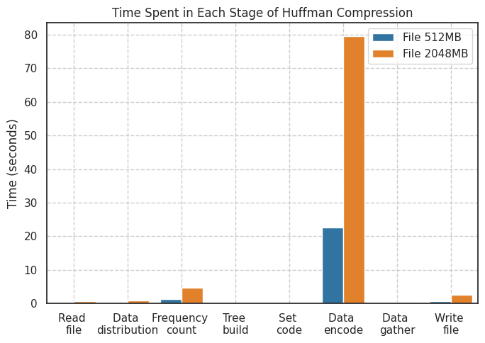
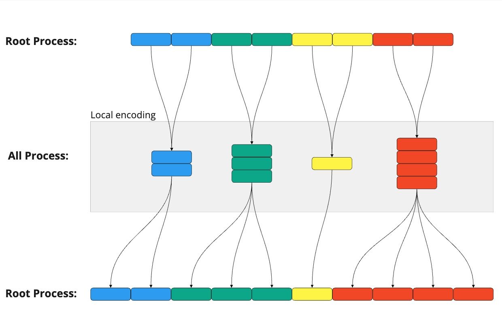
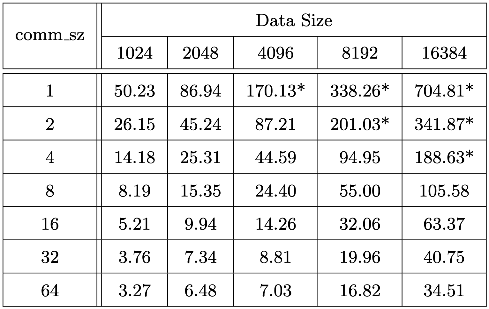
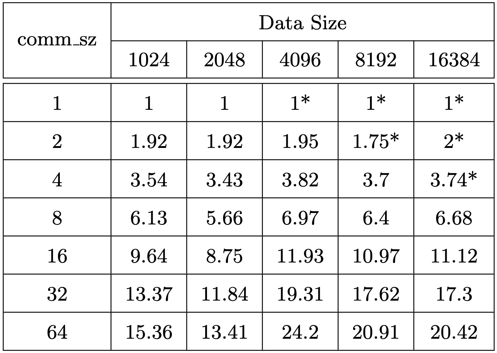
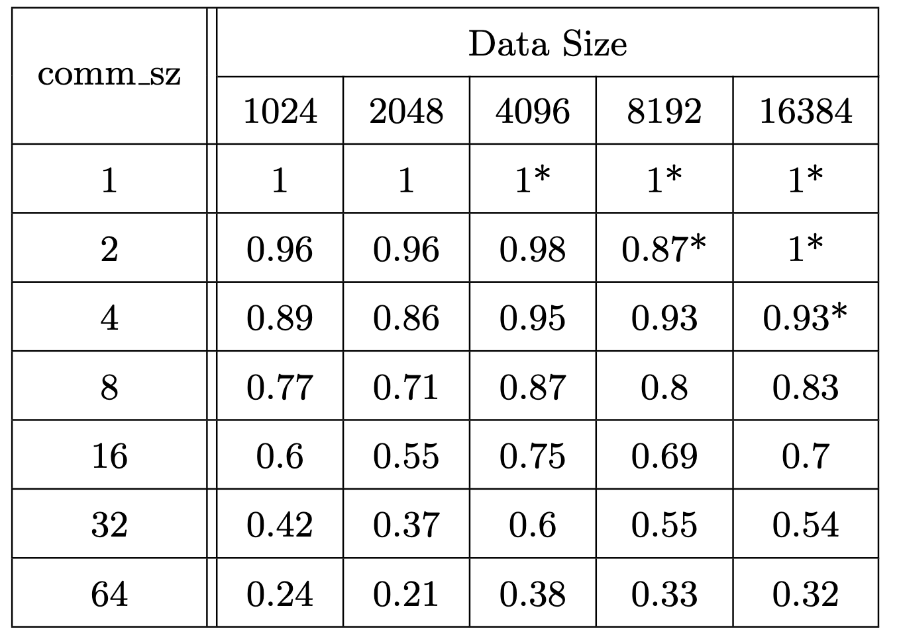
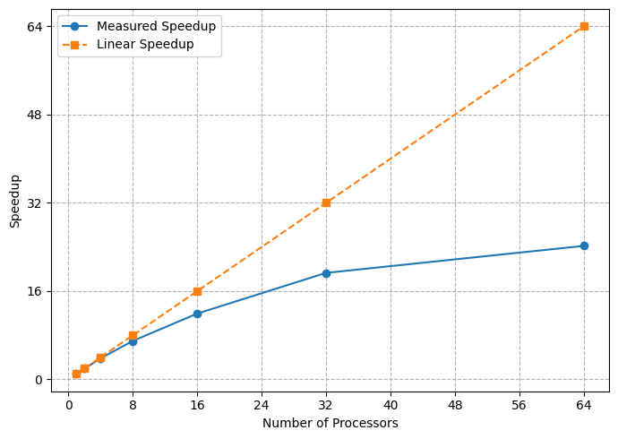
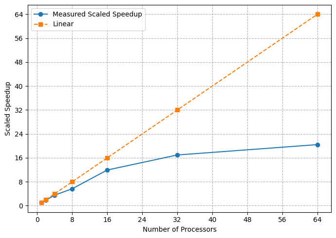

# Parallel-Huffman-HPC
Project repository for High Performance Computing for Data Science course UNITN'

### Repository Structure

```plaintext
project_root/
│
├── figures/                 # Directory for figures and images
├── LICENSE                  # Licensing information
├── README.md                # Introduction and instructions
├── generate.sh              # Shell script used for generating synthetic datasets 
├── huffman_encoding.c        # C source code for Huffman encoding
├── huffman_encoding.sh       # Shell script for Huffman encoding tasks
├── file_10M.txt             # Sample 10 MB text file
├── parallel_huffman.pdf     # Project report document
│
```
## Getting Started
Follow these steps to set up and run the project:

- **Generate synthetic datasets**
  script file for generating synthetic datasets. It uses file_10M.txt (10 MB) to generate 256MB to 16384MB datasets for fast generating. 
```
  chmod +x generate.sh
  ./generate.sh
```
- **Module load**
  ```
  module load mpich-3.2
  ```
- **Code compile**
  ```
  mpicc -g -Wall -o huffman_encoding huffman_encoding.c
  ```
- **PBS job instruction and submission**
  Set the number of chunks, cores, wall time, dataset, etc, as you prefer. And call the following code: 
```
  qsub huffman_encoding.sh
```

## Results

**Runtime difference**



**Data distribution and gathering**



**Runtime, speedup, efficiency**

|  <br> **Figure 1:** Runtime |  <br> **Figure 2:** Speedup |  <br> **Figure 3:** Efficiency |
|:--:|:--:|:--:|


**Scalability**

|  <br> **Figure 1:** Strong scalability |  <br> **Figure 2:** Weak scalability |
|:--:|:--:|


